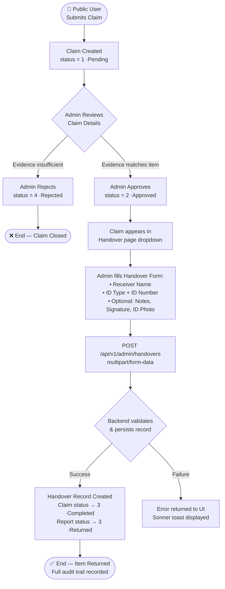
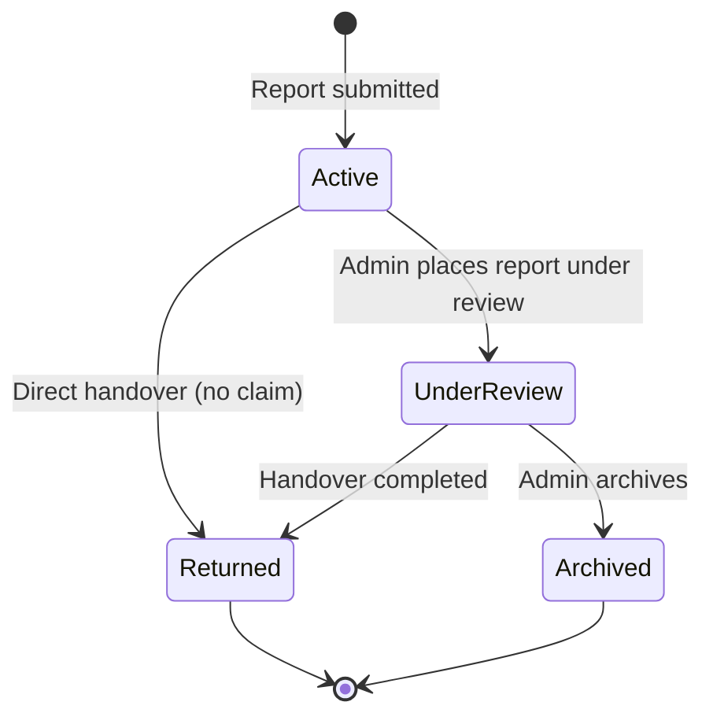

# Backend Architecture & API Guide

> **HU Asset Gateway** — .NET 8 Web API

---

## 📋 Table of Contents

- [Architecture Overview](#-architecture-overview)
- [Project Layer Structure](#-project-layer-structure)
- [Security & Authentication](#-security--authentication)
- [RBAC Matrix](#-rbac-matrix)
- [Standard API Response Contract](#-standard-api-response-contract)
- [API Endpoint Reference](#-api-endpoint-reference)
- [Core Workflows](#-core-workflows)
  - [Claim → Approval → Handover Lifecycle](#claim--approval--handover-lifecycle)
  - [Report Status Lifecycle](#report-status-lifecycle)
- [Database Schema Summary](#-database-schema-summary)
- [Error Handling Conventions](#-error-handling-conventions)

---

## 🏗️ Architecture Overview

The backend follows a **pragmatic, simplified Clean Architecture** — retaining strict separation of concerns without over-engineering ceremony. The goal is to keep the codebase navigable and maintainable for a small-to-medium team while preserving domain boundaries.

### Design Principles

| Principle | Application |
|---|---|
| **Separation of Concerns** | Controllers delegate immediately to a Service/Use Case layer; no business logic in controllers |
| **Domain-Driven Boundaries** | Each feature (Reports, Claims, Handovers, etc.) is a self-contained module |
| **Single Responsibility** | Each service class handles one domain aggregate |
| **Repository Abstraction** | Data access is behind interfaces; EF Core is an implementation detail, not a dependency |
| **API-First Design** | All responses conform to a single envelope contract for consistent frontend consumption |

### What "Simplified" Means

This is **not** a full CQRS/Event Sourcing architecture. The pragmatic trade-offs made:

- **No MediatR** — Service classes are called directly from controllers (avoids over-abstraction for this scale)
- **No Domain Events** — State changes are handled synchronously within service methods
- **Shared DTOs** — Request/response objects may be reused where the shape is identical
- **EF Core directly in repositories** — No Unit of Work pattern overhead beyond what EF Core's `DbContext` already provides

This keeps the codebase approachable while still enforcing the critical Clean Architecture boundaries.

---

## 📁 Project Layer Structure

```
HUAssetGateway.API/
├── Controllers/              # Thin HTTP boundary — validates, delegates, returns HTTP results
│   ├── AuthController.cs
│   ├── ReportsController.cs
│   ├── ClaimsController.cs
│   ├── HandoversController.cs
│   ├── UsersController.cs
│   ├── AuditLogsController.cs
│   ├── FeedbackController.cs
│   ├── NotificationsController.cs
│   ├── DashboardController.cs
│   └── ProfileController.cs
│
├── Services/                 # Business logic — orchestrates repositories, applies rules
│   ├── AuthService.cs
│   ├── ReportService.cs
│   ├── ClaimService.cs
│   ├── HandoverService.cs
│   ├── UserService.cs
│   └── ...
│
├── Repositories/             # Data access — EF Core queries and persistence
│   ├── ReportRepository.cs
│   ├── ClaimRepository.cs
│   └── ...
│
├── Domain/
│   ├── Entities/             # EF Core entity classes (pure C# with navigation props)
│   │   ├── Report.cs
│   │   ├── Claim.cs
│   │   ├── Handover.cs
│   │   ├── AppUser.cs        # Extends IdentityUser
│   │   ├── AuditLog.cs
│   │   ├── Feedback.cs
│   │   └── ...
│   └── Enums/                # Shared enum definitions
│       ├── ReportType.cs
│       ├── ReportStatus.cs
│       ├── ClaimApprovalStatus.cs
│       └── IdType.cs
│
├── DTOs/                     # Request and Response shapes
│   ├── Requests/
│   └── Responses/
│
├── Infrastructure/
│   ├── Data/
│   │   ├── AppDbContext.cs   # EF Core DbContext
│   │   └── Migrations/
│   ├── Identity/             # ASP.NET Core Identity configuration
│   └── Extensions/           # DI registration, middleware, CORS
│
└── appsettings.json
```

### Dependency Flow

```
HTTP Request
    │
    ▼
Controller             ← validates HTTP, maps to DTOs, returns IActionResult
    │
    ▼
Service (Use Case)     ← enforces business rules, orchestrates multiple repos
    │
    ▼
Repository Interface   ← abstract data access contract
    │
    ▼
Repository Impl        ← EF Core + AppDbContext
    │
    ▼
SQL Server Database
```

> **Rule:** Nothing flows in reverse. A repository never calls a service. A service never touches `HttpContext`. A controller never touches EF Core directly.

---

## 🔐 Security & Authentication

### JWT Bearer Token Flow

1. Client POSTs credentials to `POST /api/v1/auth/login`
2. Server validates against ASP.NET Identity user store
3. On success, server generates a **signed JWT** containing:
   - `sub` — User ID
   - `name` — User's display name
   - `http://schemas.microsoft.com/ws/2008/06/identity/claims/role` — User's role(s) (standard .NET claim key)
   - `exp` — Expiry timestamp
   - `iss` / `aud` — Issuer and audience validation
4. Client stores token and sends it as `Authorization: Bearer <token>` on every subsequent request
5. Server's JWT middleware validates signature and claims on every protected endpoint

### Token Role Extraction (Frontend)

The frontend reads the role claim from the JWT using `jwt-decode` and the exact .NET claim key:

```typescript
// src/lib/authUtils.ts
const ROLE_CLAIM_KEY = "http://schemas.microsoft.com/ws/2008/06/identity/claims/role";

export function extractRolesFromToken(token: string): string[] {
  const decoded = jwtDecode<DotNetJwtPayload>(token);
  const roles = decoded[ROLE_CLAIM_KEY];
  // .NET returns a string for one role, array for multiple — normalized here
  return Array.isArray(roles) ? roles : [roles];
}
```

### SuperAdmin Account Protection

The SuperAdmin account receives **dual-layer immutability protection**:

- **API Layer**: The backend must reject any `PUT`/`PATCH`/`DELETE` request targeting the SuperAdmin user's ID for role changes, blocks, or deletion.
- **UI Layer**: The frontend `UsersTable` and `EditUserModal` suppress destructive actions for any user whose `roles` array contains `"Super Admin"` or `"SuperAdmin"`. The Role dropdown is rendered as a locked, read-only field with explanatory helper text.

---

## 🔑 RBAC Matrix

The system enforces two roles: **Super Admin** (full access) and **Admin** (operational access).

### Endpoint Access by Role

| Endpoint Group | Method | Path | Admin | SuperAdmin |
|---|---|---|:---:|:---:|
| Auth | POST | `/api/v1/auth/login` | ✅ | ✅ |
| Auth | POST | `/api/v1/auth/logout` | ✅ | ✅ |
| Profile | GET | `/api/v1/profile/me` | ✅ | ✅ |
| Profile | PUT | `/api/v1/profile/me` | ✅ | ✅ |
| Dashboard | GET | `/api/v1/admin/dashboard/stats` | ✅ | ✅ |
| Reports | GET | `/api/v1/admin/reports` | ✅ | ✅ |
| Reports | GET | `/api/v1/reports/{id}` | ✅ | ✅ |
| Reports | PUT | `/api/v1/reports/{id}` | ✅ | ✅ |
| Reports | PUT | `/api/v1/admin/reports/{id}/status` | ✅ | ✅ |
| Reports | DELETE | `/api/v1/admin/reports/{id}` | ✅ | ✅ |
| Claims | GET | `/api/v1/admin/claims` | ✅ | ✅ |
| Claims | GET | `/api/v1/admin/claims/{id}` | ✅ | ✅ |
| Claims | PUT | `/api/v1/admin/claims/{id}/approve` | ✅ | ✅ |
| Claims | PUT | `/api/v1/admin/claims/{id}/reject` | ✅ | ✅ |
| Handovers | POST | `/api/v1/admin/handovers` | ✅ | ✅ |
| Handovers | GET | `/api/v1/admin/handovers/{id}` | ✅ | ✅ |
| Handovers | GET | `/api/v1/admin/handovers/claim/{claimId}` | ✅ | ✅ |
| Feedback | GET | `/api/v1/admin/feedbacks` | ✅ | ✅ |
| Feedback | POST | `/api/v1/admin/feedbacks/{id}/reply` | ✅ | ✅ |
| Notifications | GET | `/api/v1/notifications/me` | ✅ | ✅ |
| Notifications | PUT | `/api/v1/notifications/{id}/read` | ✅ | ✅ |
| Notifications | DELETE | `/api/v1/notifications/{id}` | ✅ | ✅ |
| Master Data (Read) | GET | `/api/v1/universities`, `/api/v1/departments`, `/api/v1/locations`, `/api/v1/categories` | ✅ | ✅ |
| Master Data (Write) | POST/PUT/DELETE | `/api/v1/admin/{entity}` | ✅ | ✅ |
| **Users** | **GET** | **`/api/v1/admin/users`** | **❌** | **✅** |
| **Users** | **POST** | **`/api/v1/admin/users`** | **❌** | **✅** |
| **Users** | **PUT/PATCH/DELETE** | **`/api/v1/admin/users/{id}/*`** | **❌** | **✅** |
| **Users** | **GET** | **`/api/v1/admin/users/export`** | **❌** | **✅** |
| **Audit Logs** | **GET** | **`/api/v1/admin/audit-logs`** | **❌** | **✅** |
| **Audit Logs** | **GET** | **`/api/v1/admin/audit-logs/export`** | **❌** | **✅** |

---

## 📐 Standard API Response Contract

All endpoints return responses conforming to one of two shapes. The frontend TypeScript types mirror these exactly.

### Single-Item Response

```json
{
  "succeeded": true,
  "message": "Operation completed successfully",
  "data": { ... },
  "errors": null
}
```

On failure:
```json
{
  "succeeded": false,
  "message": "Claim not found",
  "data": null,
  "errors": ["Entity with ID 42 does not exist"]
}
```

### Paginated List Response

```json
{
  "pageNumber": 1,
  "pageSize": 10,
  "totalPages": 5,
  "totalRecords": 47,
  "succeeded": true,
  "message": "Records retrieved successfully",
  "data": [ ... ]
}
```

### TypeScript Types (Frontend Mirror)

```typescript
// src/types/api.ts
export interface ApiResponse<T> {
    succeeded: boolean;
    message: string;
    data: T;
    errors: string[] | null;
}

export interface PaginatedApiResponse<T> {
    pageNumber: number;
    pageSize: number;
    totalPages: number;
    totalRecords: number;
    succeeded: boolean;
    message: string;
    data: T;
}
```

---

## 🌐 API Endpoint Reference

### Authentication

| Method | Endpoint | Body | Description |
|---|---|---|---|
| POST | `/api/v1/auth/login` | `{ email, password }` | Returns JWT + refresh token |
| POST | `/api/v1/auth/logout` | — | Invalidates session server-side |

**Login Response `data` shape:**
```json
{
  "token": "eyJhbGciOiJIUzI1NiIs...",
  "refreshToken": "abc123...",
  "expiration": "2026-06-19T10:00:00Z"
}
```

---

### Profile

| Method | Endpoint | Body | Description |
|---|---|---|---|
| GET | `/api/v1/profile/me` | — | Returns the authenticated user's profile |
| PUT | `/api/v1/profile/me` | `multipart/form-data` | Updates name, email, and optional profile image |

**`PUT` form fields:**
- `Name` (string, required)
- `Email` (string, required)
- `ProfileImage` (binary file, optional)

> The endpoint accepts `multipart/form-data` because profile image is a binary file. Axios automatically sets the correct `multipart/form-data; boundary=...` header when the request body is a `FormData` instance.

---

### Reports

| Method | Endpoint | Query Params | Description |
|---|---|---|---|
| GET | `/api/v1/admin/reports` | `pageNumber`, `pageSize`, `search`, `categoryId`, `locationId`, `statusType`, `reportType`, `fromDate`, `toDate` | Paginated list with filters |
| GET | `/api/v1/reports/{id}` | — | Full details of a single report |
| PUT | `/api/v1/reports/{id}` | — | Update report fields |
| PUT | `/api/v1/admin/reports/{id}/status` | — | Change report status: `{ statusType: number }` |
| DELETE | `/api/v1/admin/reports/{id}` | — | Permanently delete a report |

**Report Types:**

| Value | Label |
|---|---|
| `1` | Lost |
| `2` | Found |

**Report Status Values:**

| Value | Label |
|---|---|
| `1` | Active / Open |
| `2` | Under Review |
| `3` | Returned / Resolved |
| `4` | Archived |

---

### Claims

| Method | Endpoint | Description |
|---|---|---|
| GET | `/api/v1/admin/claims` | Paginated list (`pageNumber`, `pageSize`) |
| GET | `/api/v1/admin/claims/{id}` | Full claim details |
| PUT | `/api/v1/admin/claims/{id}/approve` | Transitions claim to Approved (status `2`) |
| PUT | `/api/v1/admin/claims/{id}/reject` | Transitions claim to Rejected (status `4`) |

**Claim Approval Status Enum:**

| Value | Label | UI Actions Available |
|---|---|---|
| `1` | Pending | ✅ Approve, ✅ Reject |
| `2` | Approved | ❌ (eligible for Handover) |
| `3` | Completed | ❌ (handover done) |
| `4` | Rejected | ❌ |

> **Business Rule:** Only `Pending` (status `1`) claims display the Approve/Reject action buttons in the UI. All other states are read-only in the admin interface.

---

### Handovers

| Method | Endpoint | Body | Description |
|---|---|---|---|
| POST | `/api/v1/admin/handovers` | `multipart/form-data` | Creates a new handover record |
| GET | `/api/v1/admin/handovers/{id}` | — | Retrieves handover details by ID |
| GET | `/api/v1/admin/handovers/claim/{claimId}` | — | Retrieves handover linked to a specific claim |

**`POST` form fields:**

| Field | Type | Required | Description |
|---|---|---|---|
| `ReceiverName` | string | ✅ | Name of the person receiving the item |
| `IdType` | number | ✅ | `1` = National ID, `2` = Passport, `3` = University ID |
| `IdNumber` | string | ✅ | The ID document number |
| `Notes` | string | ❌ | Optional handover notes |
| `ClaimId` | number | Conditional | Required if handover is linked to a claim |
| `ReportId` | number | Conditional | Required if handover is linked to a report directly |
| `DigitalSignature` | binary | ❌ | Signature image file |
| `IdPhoto` | binary | ❌ | Photo of the presented ID document |

**ID Type Enum:**

| Value | Label |
|---|---|
| `1` | National ID |
| `2` | Passport |
| `3` | University ID |

> **Business Rule:** The frontend `Handover` page only populates the claim dropdown with claims where `approvalStatus === 2` (Approved). Claims in any other state are excluded from selection.

---

### Users *(SuperAdmin only)*

| Method | Endpoint | Description |
|---|---|---|
| GET | `/api/v1/admin/users` | Paginated list (`pageNumber`, `pageSize`, `searchTerm`, `role`) |
| POST | `/api/v1/admin/users` | Create a new admin user |
| PUT | `/api/v1/admin/users/{id}` | Update user name/email |
| PATCH | `/api/v1/admin/users/{id}/role` | Change user role: `{ role: "Admin" }` |
| PATCH | `/api/v1/admin/users/{id}/block` | Toggle user active/blocked status |
| POST | `/api/v1/admin/users/{id}/reset-password` | Force-reset password, returns `{ newPassword }` |
| GET | `/api/v1/admin/users/export` | Export user list as a file (binary blob) |

---

### Audit Logs *(SuperAdmin only)*

| Method | Endpoint | Query Params | Description |
|---|---|---|---|
| GET | `/api/v1/admin/audit-logs` | `page`, `pageSize`, `searchTerm` | Paginated, searchable audit log |
| GET | `/api/v1/admin/audit-logs/export` | — | Export full audit log as a file (binary blob) |

---

### Feedback

| Method | Endpoint | Body | Description |
|---|---|---|---|
| GET | `/api/v1/admin/feedbacks` | `?pendingOnly=true/false` | List all feedback (optional filter) |
| POST | `/api/v1/admin/feedbacks/{id}/reply` | `{ replyText: string }` | Submit an admin reply to a feedback item |

**Feedback Status Logic (UI-side):**

| `isReplied` Value | Status Badge | Reply Button |
|---|---|---|
| `false` | 🟡 Awaiting Reply | Visible |
| `true` | 🟢 Replied | Hidden |

---

### Master Data

All entities follow the same CRUD pattern:

| Method | Endpoint | Description |
|---|---|---|
| GET | `/api/v1/universities` | List all colleges |
| POST | `/api/v1/admin/universities` | Create a college |
| PUT | `/api/v1/admin/universities/{id}` | Update a college |
| DELETE | `/api/v1/admin/universities/{id}` | Delete a college |
| GET | `/api/v1/departments` | List all departments |
| POST/PUT/DELETE | `/api/v1/admin/departments/{id?}` | CRUD for departments |
| GET | `/api/v1/locations` | List all locations |
| POST/PUT/DELETE | `/api/v1/admin/locations/{id?}` | CRUD for locations |
| GET | `/api/v1/categories` | List all item categories |
| POST/PUT/DELETE | `/api/v1/admin/categories/{id?}` | CRUD for categories |

---

### Dashboard

| Method | Endpoint | Description |
|---|---|---|
| GET | `/api/v1/admin/dashboard/stats` | Returns overview KPIs, category breakdown, weekly activity, and recent actions |

**Response `data` structure:**
```json
{
  "overview": {
    "activeReports": 42,
    "activeReportsTrend": "+5%",
    "pendingClaims": 8,
    "pendingClaimsTrend": "-2%",
    "recoveryRate": 73.5,
    "recoveryRateTrend": "+1.2%",
    "totalUsers": 120,
    "totalUsersTrend": "+3"
  },
  "reportsByCategory": [
    { "categoryName": "Electronics", "count": 18 }
  ],
  "weeklyActivity": [
    { "day": "Mon", "lostCount": 5, "foundCount": 3 }
  ],
  "recentActivity": [
    { "action": "Claim Approved", "details": "...", "status": "Approved", "timeAgo": "2h ago" }
  ]
}
```

---

## 🔄 Core Workflows

### Claim → Approval → Handover Lifecycle

This is the most critical end-to-end workflow in the system. It ensures a lost item is only returned after a structured, verifiable process.



**State transitions triggered by Handover success:**

| Entity | Before | After |
|---|---|---|
| `Claim.approvalStatus` | `2` (Approved) | `3` (Completed) |
| `Report.status` (if linked) | Any | `3` (Returned/Resolved) |

These transitions are applied via **optimistic cache updates** on the frontend (`useHandovers.ts → useCreateHandover → onSuccess`) before server confirmation, and also via `invalidateQueries` to force a fresh re-fetch.

---

### Report Status Lifecycle



| Status Value | Label | Description |
|---|---|---|
| `1` | Active | Newly submitted, visible to the public |
| `2` | Under Review | A claim is being processed |
| `3` | Returned | Item has been handed over to owner |
| `4` | Archived | Administratively closed |

---

## 🗄️ Database Schema Summary

The following tables represent the core domain model. All tables include standard audit columns (`CreatedAt`, `UpdatedAt`) unless noted.

### `AspNetUsers` (extended by `AppUser`)

| Column | Type | Notes |
|---|---|---|
| `Id` | `nvarchar(450)` PK | ASP.NET Identity standard |
| `Name` | `nvarchar(256)` | Display name |
| `Email` | `nvarchar(256)` | Unique, used for login |
| `IsActive` | `bit` | Block/unblock flag |
| `ProfileImageUrl` | `nvarchar(max)` | Relative URL to uploaded image |

### `Reports`

| Column | Type | Notes |
|---|---|---|
| `Id` | `int` PK, auto-increment | |
| `ItemName` | `nvarchar(256)` | |
| `Description` | `nvarchar(max)` | |
| `ReportType` | `int` | `1` = Lost, `2` = Found |
| `Status` | `int` | `1` Active → `4` Archived |
| `CategoryId` | `int` FK → `Categories` | |
| `LocationId` | `int` FK → `Locations` | |
| `UserId` | `nvarchar(450)` FK → `AspNetUsers` | Reporter |
| `DateReported` | `datetime2` | |

### `Claims`

| Column | Type | Notes |
|---|---|---|
| `Id` | `int` PK, auto-increment | |
| `ClaimCode` | `nvarchar(50)` | Human-readable reference |
| `ReportId` | `int` FK → `Reports` | The item being claimed |
| `ClaimantUserId` | `nvarchar(450)` FK → `AspNetUsers` | |
| `Description` | `nvarchar(max)` | Claimant's proof description |
| `ApprovalStatus` | `int` | `1`=Pending, `2`=Approved, `3`=Completed, `4`=Rejected |
| `MatchScore` | `decimal(5,2)` NULL | Optional AI/manual match confidence |
| `Remarks` | `nvarchar(max)` NULL | Admin notes on decision |
| `ClaimDate` | `datetime2` | |

### `Handovers`

| Column | Type | Notes |
|---|---|---|
| `Id` | `int` PK, auto-increment | |
| `ClaimId` | `int` FK → `Claims` NULL | |
| `ReportId` | `int` FK → `Reports` NULL | At least one must be set |
| `ReceiverName` | `nvarchar(256)` | |
| `IdType` | `int` | `1`=National ID, `2`=Passport, `3`=University ID |
| `IdNumber` | `nvarchar(100)` | |
| `Notes` | `nvarchar(max)` NULL | |
| `HandoverDate` | `datetime2` | Server-set on creation |
| `DigitalSignatureUrl` | `nvarchar(max)` NULL | Relative path to stored file |
| `IdPhotoUrl` | `nvarchar(max)` NULL | Relative path to stored file |

### `Feedbacks`

| Column | Type | Notes |
|---|---|---|
| `Id` | `int` PK | |
| `UserId` | `nvarchar(450)` FK | Submitting user |
| `Subject` | `nvarchar(256)` | |
| `Message` | `nvarchar(max)` | |
| `Rating` | `int` | Star rating (1–5) |
| `IsReplied` | `bit` | Flipped to `true` when admin replies |
| `AdminReply` | `nvarchar(max)` NULL | |
| `CreatedAt` | `datetime2` | |

### `AuditLogs`

| Column | Type | Notes |
|---|---|---|
| `Id` | `int` PK | |
| `UserId` | `nvarchar(450)` FK | Who performed the action |
| `Action` | `nvarchar(256)` | Human-readable action description |
| `EntityType` | `nvarchar(100)` | e.g., `"Report"`, `"Claim"` |
| `EntityId` | `nvarchar(100)` NULL | ID of the affected entity |
| `Timestamp` | `datetime2` | Server-set, immutable |
| `IpAddress` | `nvarchar(50)` NULL | |

### Master Data Tables

All follow the same pattern: `Id` (int PK), `Name` (nvarchar), `NameAr` (nvarchar, nullable for Arabic), plus entity-specific FKs.

| Table | Key FK |
|---|---|
| `Universities` (Colleges) | — |
| `Departments` | `UniversityId` |
| `Locations` | `DepartmentId`, `LocationType` (int) |
| `Categories` | — |

---

## ⚠️ Error Handling Conventions

### HTTP Status Codes Used

| Status | Meaning | When Used |
|---|---|---|
| `200 OK` | Success | All successful GET, PUT, PATCH, DELETE |
| `201 Created` | Resource created | POST operations that create a record |
| `400 Bad Request` | Validation failure | Invalid input, business rule violation |
| `401 Unauthorized` | Missing/invalid token | No or expired JWT |
| `403 Forbidden` | Insufficient permissions | Valid token but wrong role |
| `404 Not Found` | Resource missing | Queried entity does not exist |
| `500 Internal Server Error` | Unhandled exception | Logged server-side, generic message to client |

### Error Response Body

```json
{
  "succeeded": false,
  "message": "The claim is not in a Pending state and cannot be approved.",
  "data": null,
  "errors": [
    "ClaimId 42 has ApprovalStatus = 2 (Approved). Only Pending claims can be approved."
  ]
}
```

### Frontend Handling

The Axios `apiClient.ts` response interceptor catches `401` and `403` status codes globally and logs them. Individual query hooks propagate the error to TanStack Query's `isError` / `error` state, which pages use to display error messaging. Mutations use Sonner toasts (`toast.error(...)`) for user-visible failure feedback.

---

*← [Back to README](../README.md) · [Frontend Guide →](./frontend.md)*
